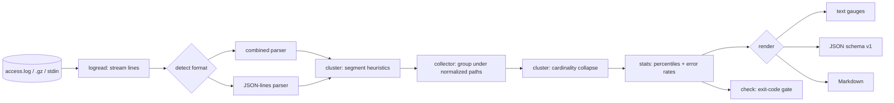

# routegauge

[English](README.md) | [中文](README.zh.md) | [日本語](README.ja.md)

[](LICENSE) [](go.mod) [](CHANGELOG.md)  [](CONTRIBUTING.md)

**routegauge：すでにローテートしているアクセスログを API 分析レポートに変える、オープンソースのゼロ依存 CLI——エンドポイント自動クラスタリング（`/users/123` → `/users/:id`）、エンドポイント別レイテンシパーセンタイル、エラー率レポート。**


```bash
git clone https://github.com/JaydenCJ/routegauge && cd routegauge
go build -o routegauge ./cmd/routegauge    # single static binary, stdlib only
```

> プレリリース：v0.1.0 はまだどのレジストリにも公開されていません。上記の手順でソースからビルドしてください（Go ≥1.22 なら可）。

## なぜ routegauge？

「火曜のデプロイ以降、orders エンドポイントの p95 は？」と聞かれたとき、多くのチームの正直な答えは*わからない*だ——API は計装されておらず、イベント課金の APM（Moesif、Datadog）は nginx のログで答えられる質問には高すぎる。厄介なのは、生ログの答え方が下手なこと：`/users/123` と `/users/456` は別 URL なので、`awk` のヒストグラムも GoAccess のダッシュボードも 1 つのエンドポイントを何千行にも砕いてしまう。routegauge が直すのはまさにその一段だ。ローテート済みの `access.log*`（gzip 込み）をストリームで読み、生パスをルートパターンへ自動クラスタリング——数値 ID・UUID・ハッシュ・日付は形状で、slug はカーディナリティで、ルート表は不要——し、エンドポイントごとのリクエスト数、正確な p50/p95/p99、エラー率をターミナルレポート・JSON・Markdown で出力する。これはレポート CLI であり観測コンソールではない：デーモンもストレージもエージェントも、デプロイするものも無い——さらに `check` サブコマンドが同じ数字を exit 1 のデプロイゲートに変える。

| | routegauge | GoAccess | awk / 使い捨てスクリプト | Moesif / Datadog APM |
|---|---|---|---|---|
| `/users/123` → `/users/:id` を自動クラスタリング | ✅ | ❌ 生 URL のまま | ❌ 手書き正規表現 | ✅ アプリ SDK 経由 |
| エンドポイント別 p50/p95/p99 | ✅ 正確値 | ⚠️ 平均/最大所要のみ | ❌ 自作 | ✅ |
| 手元にあるログでそのまま動く | ✅ | ✅ | ✅ | ❌ アプリ計装が必要 |
| ローテート済み `.gz` を直接読む | ✅ | ✅ | ⚠️ zcat の配管 | n/a |
| 終了コード付きデプロイゲート | ✅ `check` | ❌ | ❌ | ⚠️ 別途モニター |
| コストモデル | 無料・ローカル | 無料・ローカル | 無料・壊れやすい | イベント/ホスト課金 |
| ランタイム依存 | 0 | ncurses + C ライブラリ | — | SaaS + エージェント |

<sub>2026-07-13 時点の確認：routegauge が import するのは Go 標準ライブラリのみ。GoAccess のビルドは ncurses（＋任意の GeoIP/SSL ライブラリ）に依存。Moesif と Datadog はイベント/ホスト量で課金。</sub>

## 特徴

- **エンドポイント自動クラスタリング** — 2 段構え：形状ヒューリスティクスが数値 ID・UUID・git 風ハッシュ・日付・メール・API トークンを `:id`/`:uuid`/`:hash`/`:date`/`:email`/`:token` に写像し、続くカーディナリティ解析が高ファンアウトの slug セグメントを `:param` に畳む。API バージョンセグメント（`v1`、`v2`）はリテラルのまま。
- **正確なレイテンシパーセンタイル** — method+route ごとの最近接順位法 p50/p90/p95/p99/avg/max。全サンプルから計算し、近似スケッチではない。`--sort p95` で遅いエンドポイントが即座に浮かぶ。
- **エラー率レポート** — ルート別の 4xx/5xx 件数と比率、ステータスコードヒストグラム、5xx 優先の並び。nginx の `"-"` 不正リクエスト行は `(unparsed)` として見えたままにし、握りつぶさない。
- **すでにローテートしているファイルで** — `$request_time` 付き combined/common ログ、エイリアス表で解く JSON-lines ログ、`.gz` ローテーションの透過読み込み、1 回の実行で複数ファイル、`-` で stdin、ファイルごとのフォーマット自動判定。
- **ダッシュボードではなくデプロイゲート** — `routegauge check --max-error-rate 5 --max-p95 800ms` は超過で exit 1。全体でもルート別でも、デプロイフックや夜間 cron にそのまま挿せる。
- **3 つの出力形式** — 人間にはターミナルゲージ、スクリプトには安定したバージョン付き JSON（`schema_version: 1`）、PR コメントや障害ドキュメントにはそのまま貼れる Markdown。
- **ゼロ依存・完全オフライン** — Go 標準ライブラリのみ。指定されたファイルを読んで stdout に書くだけで、ソケットは一切開かない。テレメトリは永久に無し。

## クイックスタート

```bash
# fabricate a deterministic one-hour demo log (or point at your own access.log)
bash examples/make-demo-log.sh /tmp/demo-access.log
./routegauge report /tmp/demo-access.log
```

実際にキャプチャした出力：

```text
routegauge report — 201 requests, 9 routes
window: 2026-07-06 09:00:17 UTC → 2026-07-06 09:59:59 UTC
skipped: 1 unparseable line

status  2xx ███████████████████████░ 96.5%   4xx 2.5%   5xx 1.0%

method  endpoint                     requests    err%      p50      p95      p99      max
GET     /api/users/:id                     68    5.9%     40ms     67ms     71ms     71ms
GET     /api/users/:id/orders              26    0.0%     51ms     84ms     90ms     90ms
GET     /health                            24    0.0%    1.0ms    1.0ms    1.0ms    1.0ms
POST    /api/orders                        22    4.5%    215ms    296ms    306ms    306ms
GET     /api/orders/:uuid                  21    0.0%     35ms     54ms     57ms     57ms
GET     /api/search                        21    4.8%    569ms    827ms    832ms    832ms
GET     /api/export/:date.csv              11    0.0%    1.66s    1.88s    1.88s    1.88s
GET     /assets/app.3f8a92b1c04d.js         7    0.0%    3.0ms    3.0ms    3.0ms    3.0ms
-       (unparsed)                          1  100.0%   0.00ms   0.00ms   0.00ms   0.00ms

9 routes total, overall p95 1.21s
```

クラスタリング結果を確かめる（`routegauge endpoints`、実出力）：

```text
GET     /api/users/:id
        68 requests, 65 distinct paths — e.g. /api/users/1071, /api/users/1261, /api/users/1373
GET     /api/users/:id/orders
        26 requests, 25 distinct paths — e.g. /api/users/1100/orders, /api/users/1172/orders, /api/users/1217/orders
```

デプロイにゲートを掛ける（`routegauge check`、超過で終了コード 1）：

```text
overall error rate                                   3.5%  (limit 5.0%)  ok
overall p95                                        1.209s  (limit 800ms)  BREACH
check: FAIL
```

ローテート済みログも構造化ログも使い方は同じ：

```bash
routegauge report /var/log/nginx/access.log /var/log/nginx/access.log.*.gz
kubectl logs api-7d4b | routegauge report --log-format jsonl -
```

## ログにレイテンシを入れるには

パーセンタイルには所要時間フィールドが要る。素の combined ログには無い（それでも routegauge はトラフィックとエラー率を報告し、その旨を明示する）。nginx なら 1 行で足りる：

```nginx
log_format timed '$remote_addr - $remote_user [$time_local] "$request" '
                 '$status $body_bytes_sent "$http_referer" "$http_user_agent" '
                 '$request_time';
access_log /var/log/nginx/access.log timed;
```

JSON-lines ログでは、最初に一致したエイリアスを解決する——フィールド名が単位を運ぶ：

| フィールド名 | 単位 |
|---|---|
| `request_time`、`duration`、`latency`、`response_time`、`elapsed`、`duration_s` | 秒 |
| `duration_ms`、`latency_ms`、`response_time_ms`、`request_time_ms`、`elapsed_ms`、`time_taken_ms` | ミリ秒 |
| `duration_us`、`latency_us` / `duration_ns`、`latency_ns` | マイクロ秒 / ナノ秒 |
| 上記いずれかを Go duration 文字列で（`"12.5ms"`） | 記載どおり |

## エンドポイントクラスタリング

第 1 段が各セグメントを形状で分類し、第 2 段が `--cluster-threshold`（デフォルト 12）を超える数の異なるリテラル兄弟を持つ木の位置を `:param` に畳み、部分木を再帰的にマージする。全ルール・境界反例・チューニング指針は [docs/clustering.md](docs/clustering.md) を参照。

| 生パス | ルート |
|---|---|
| `/api/users/1042` | `/api/users/:id` |
| `/api/orders/9e107d9d-372b-4b6e-8a2f-276173a5f1b3` | `/api/orders/:uuid` |
| `/commits/da39a3ee5e6b…` | `/commits/:hash` |
| `/api/export/2026-07-06.csv` | `/api/export/:date.csv` |
| `/products/blue-widget`（× 数百の slug） | `/products/:param` |
| `/api/v2/users/7` | `/api/v2/users/:id` — バージョンはリテラルのまま |

## CLI リファレンス

`routegauge [report|endpoints|errors|check|version] [flags] <files…>` — ファイルは通常ファイル・`.gz`・stdin の `-`。フラグはファイルより前に書く。終了コード：0 正常、1 check 超過、2 使い方エラー、3 実行時エラー。

| フラグ | デフォルト | 効果 |
|---|---|---|
| `--log-format` | `auto` | 入力方言：`auto`、`combined`（common 含む）、`jsonl` |
| `--format` | `text` | 出力：`text`、`json`（全ルート）、`markdown`（report のみ） |
| `--sort` | `requests` | 行順：`requests`、`p95`、`errors`、`route` |
| `--top` | `20` | テキスト/Markdown 出力の行数（0 = 全部） |
| `--since` / `--until` | — | 時間窓、`YYYY-MM-DD` または RFC3339 |
| `--method` / `--path-prefix` | — | メソッド / セグメント単位のパス接頭辞で絞り込み |
| `--cluster-threshold` | `12` | `:param` へ畳む前に許容する異なるリテラル数 |
| `--no-cluster` | オフ | クラスタリングせず生パスで報告 |
| `--max-error-rate` / `--max-5xx-rate`（check） | 未設定 | 4xx+5xx / 5xx の比率がこのパーセントを超えたら失敗 |
| `--max-p95` / `--max-p99`（check） | 未設定 | レイテンシがこの時間を超えたら失敗（`800ms`、`1.5s`） |
| `--per-route` / `--min-requests`（check） | オフ / `10` | 十分なトラフィックを持つ各ルートにも制限を適用 |

## 検証

このリポジトリは CI を同梱しない。上記の主張はすべてローカル実行で検証される：

```bash
go test ./...            # 90 deterministic tests, offline, < 5 s
bash scripts/smoke.sh    # end-to-end CLI check, prints SMOKE OK
```

## アーキテクチャ



## ロードマップ

- [x] v0.1.0 — combined/common + JSON-lines 解析、2 段階エンドポイントクラスタリング、正確なパーセンタイル、エラーレポート、`check` ゲート、gzip/stdin 入力、90 テスト + smoke スクリプト
- [ ] `--buckets 1h` 時系列モードで 1 日の p95 とエラー率を描く
- [ ] 比較モード（`routegauge diff before.log after.log`）でデプロイ A/B の判定
- [ ] テキストレポートにルート別レイテンシヒストグラム
- [ ] Apache `%D`（マイクロ秒）と LTSV 入力方言
- [ ] 不正利用トリアージ向けの接続元別内訳（オプション）

全リストは [open issues](https://github.com/JaydenCJ/routegauge/issues) を参照。

## コントリビュート

Issue・議論・PR を歓迎します——ローカルワークフロー（フォーマット、vet、テスト、`SMOKE OK`）は [CONTRIBUTING.md](CONTRIBUTING.md) を参照。入門タスクは [good first issue](https://github.com/JaydenCJ/routegauge/issues?q=is%3Aissue+is%3Aopen+label%3A%22good+first+issue%22) ラベル、設計の話は [Discussions](https://github.com/JaydenCJ/routegauge/discussions) で。

## ライセンス

[MIT](LICENSE)
