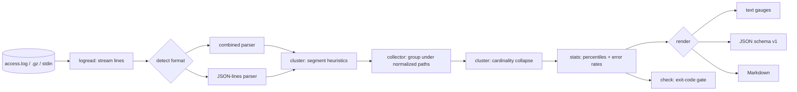

# routegauge

[English](README.md) | [中文](README.zh.md) | [日本語](README.ja.md)

[](LICENSE) [](go.mod) [](CHANGELOG.md)  [](CONTRIBUTING.md)

**routegauge：an open-source, zero-dependency CLI that turns the access logs you already rotate into API analytics — automatic endpoint clustering (`/users/123` → `/users/:id`), per-endpoint latency percentiles, and error-rate reports.**


```bash
git clone https://github.com/JaydenCJ/routegauge && cd routegauge
go build -o routegauge ./cmd/routegauge    # single static binary, stdlib only
```

> Pre-release: v0.1.0 is not tagged on a package registry yet; build from source as above (any Go ≥1.22).

## Why routegauge?

Someone asks "what's the p95 on the orders endpoint since Tuesday's deploy?" and the honest answer at most shops is *we don't know* — the API isn't instrumented, and per-event APM pricing (Moesif, Datadog) is hard to justify for a question the nginx logs can already answer. The catch is that raw logs answer it badly: `/users/123` and `/users/456` are different URLs, so `awk` histograms and even GoAccess dashboards fragment one endpoint into thousands of rows. routegauge fixes exactly that step. It streams your rotated `access.log*` files (gzip included), clusters raw paths into route patterns automatically — numeric IDs, UUIDs, hashes and dates by shape, slugs by cardinality, no route table required — then prints per-endpoint request counts, exact p50/p95/p99, and error rates as a terminal report, JSON, or Markdown. It is a report CLI, not an observability console: no daemon, no storage, no agent, nothing to deploy — and a `check` subcommand turns the same numbers into a deploy gate that exits 1.

| | routegauge | GoAccess | awk / one-off scripts | Moesif / Datadog APM |
|---|---|---|---|---|
| Clusters `/users/123` → `/users/:id` automatically | ✅ | ❌ raw URLs | ❌ hand-kept regexes | ✅ via app SDK |
| Per-endpoint p50/p95/p99 | ✅ exact | ⚠️ avg/max time served | ❌ DIY | ✅ |
| Works on logs you already have | ✅ | ✅ | ✅ | ❌ instrument the app |
| Reads rotated `.gz` directly | ✅ | ✅ | ⚠️ zcat plumbing | n/a |
| Deploy gate with exit codes | ✅ `check` | ❌ | ❌ | ⚠️ separate monitors |
| Cost model | free, local | free, local | free, fragile | per event / per host |
| Runtime dependencies | 0 | ncurses + C libs | — | SaaS + agent |

<sub>Checked 2026-07-13: routegauge imports the Go standard library only; GoAccess builds against ncurses (plus optional GeoIP/SSL libs); Moesif and Datadog price by event/host volume.</sub>

## Features

- **Automatic endpoint clustering** — two stages: shape heuristics map numeric IDs, UUIDs, git-style hashes, dates, emails and API tokens to `:id`/`:uuid`/`:hash`/`:date`/`:email`/`:token`, then a cardinality pass collapses high-fan-out slug segments into `:param`. API version segments (`v1`, `v2`) stay literal.
- **Exact latency percentiles** — nearest-rank p50/p90/p95/p99/avg/max per method+route, computed from every sample, not an approximation sketch. `--sort p95` surfaces the slow endpoints instantly.
- **Error-rate reports** — 4xx/5xx counts and rates per route, a status-code histogram, and 5xx-first ordering; nginx's `"-"` bad-request lines stay visible as `(unparsed)` instead of vanishing.
- **The files you already rotate** — combined/common logs with `$request_time`, JSON-lines logs via alias tables, `.gz` rotations read transparently, multiple files per run, `-` for stdin, and format auto-detection per file.
- **A deploy gate, not a dashboard** — `routegauge check --max-error-rate 5 --max-p95 800ms` exits 1 on breach, overall or per route, ready for deploy hooks and nightly crons.
- **Three output formats** — terminal gauges for humans, stable versioned JSON (`schema_version: 1`) for scripts, and paste-ready Markdown for PR comments and incident docs.
- **Zero dependencies, fully offline** — Go standard library only; reads the files you name, writes to stdout, and never opens a socket. No telemetry, ever.

## Quickstart

```bash
# fabricate a deterministic one-hour demo log (or point at your own access.log)
bash examples/make-demo-log.sh /tmp/demo-access.log
./routegauge report /tmp/demo-access.log
```

Real captured output:

```text
routegauge report — 201 requests, 9 routes
window: 2026-07-06 09:00:17 UTC → 2026-07-06 09:59:59 UTC
skipped: 1 unparseable line

status  2xx ███████████████████████░ 96.5%   4xx 2.5%   5xx 1.0%

method  endpoint                     requests    err%      p50      p95      p99      max
GET     /api/users/:id                     68    5.9%     40ms     67ms     71ms     71ms
GET     /api/users/:id/orders              26    0.0%     51ms     84ms     90ms     90ms
GET     /health                            24    0.0%    1.0ms    1.0ms    1.0ms    1.0ms
POST    /api/orders                        22    4.5%    215ms    296ms    306ms    306ms
GET     /api/orders/:uuid                  21    0.0%     35ms     54ms     57ms     57ms
GET     /api/search                        21    4.8%    569ms    827ms    832ms    832ms
GET     /api/export/:date.csv              11    0.0%    1.66s    1.88s    1.88s    1.88s
GET     /assets/app.3f8a92b1c04d.js         7    0.0%    3.0ms    3.0ms    3.0ms    3.0ms
-       (unparsed)                          1  100.0%   0.00ms   0.00ms   0.00ms   0.00ms

9 routes total, overall p95 1.21s
```

See what the clusterer did (`routegauge endpoints`, real output):

```text
GET     /api/users/:id
        68 requests, 65 distinct paths — e.g. /api/users/1071, /api/users/1261, /api/users/1373
GET     /api/users/:id/orders
        26 requests, 25 distinct paths — e.g. /api/users/1100/orders, /api/users/1172/orders, /api/users/1217/orders
```

Gate a deploy (`routegauge check`, exit code 1 on breach):

```text
overall error rate                                   3.5%  (limit 5.0%)  ok
overall p95                                        1.209s  (limit 800ms)  BREACH
check: FAIL
```

Rotated and structured logs work the same way:

```bash
routegauge report /var/log/nginx/access.log /var/log/nginx/access.log.*.gz
kubectl logs api-7d4b | routegauge report --log-format jsonl -
```

## Getting latency into your logs

Percentiles need a duration field; plain combined logs don't carry one (routegauge still reports traffic and error rates, and says so). One nginx line fixes it:

```nginx
log_format timed '$remote_addr - $remote_user [$time_local] "$request" '
                 '$status $body_bytes_sent "$http_referer" "$http_user_agent" '
                 '$request_time';
access_log /var/log/nginx/access.log timed;
```

For JSON-lines logs, routegauge resolves the first matching alias — names carry the unit:

| Field names | Unit |
|---|---|
| `request_time`, `duration`, `latency`, `response_time`, `elapsed`, `duration_s` | seconds |
| `duration_ms`, `latency_ms`, `response_time_ms`, `request_time_ms`, `elapsed_ms`, `time_taken_ms` | milliseconds |
| `duration_us`, `latency_us` / `duration_ns`, `latency_ns` | micro / nanoseconds |
| any of the above as a Go duration string (`"12.5ms"`) | as written |

## Endpoint clustering

Stage 1 classifies each segment by shape; stage 2 collapses any tree position with more than `--cluster-threshold` (default 12) distinct literal siblings into `:param`, merging their subtrees. Full rules, near-misses, and tuning advice in [docs/clustering.md](docs/clustering.md).

| Raw path | Route |
|---|---|
| `/api/users/1042` | `/api/users/:id` |
| `/api/orders/9e107d9d-372b-4b6e-8a2f-276173a5f1b3` | `/api/orders/:uuid` |
| `/commits/da39a3ee5e6b…` | `/commits/:hash` |
| `/api/export/2026-07-06.csv` | `/api/export/:date.csv` |
| `/products/blue-widget` (× hundreds of slugs) | `/products/:param` |
| `/api/v2/users/7` | `/api/v2/users/:id` — versions stay literal |

## CLI reference

`routegauge [report|endpoints|errors|check|version] [flags] <files…>` — files may be plain, `.gz`, or `-` for stdin; flags go before files. Exit codes: 0 ok, 1 check breach, 2 usage error, 3 runtime error.

| Flag | Default | Effect |
|---|---|---|
| `--log-format` | `auto` | input dialect: `auto`, `combined` (incl. common), `jsonl` |
| `--format` | `text` | output: `text`, `json` (all routes), `markdown` (report only) |
| `--sort` | `requests` | row order: `requests`, `p95`, `errors`, `route` |
| `--top` | `20` | rows in text/Markdown output (0 = all) |
| `--since` / `--until` | — | time window, `YYYY-MM-DD` or RFC3339 |
| `--method` / `--path-prefix` | — | filter by method / whole-segment path prefix |
| `--cluster-threshold` | `12` | distinct literals tolerated before `:param` collapse |
| `--no-cluster` | off | report raw paths, no clustering |
| `--max-error-rate` / `--max-5xx-rate` (check) | unset | fail when the 4xx+5xx / 5xx share exceeds this percent |
| `--max-p95` / `--max-p99` (check) | unset | fail when latency exceeds this duration (`800ms`, `1.5s`) |
| `--per-route` / `--min-requests` (check) | off / `10` | also enforce limits on every route with enough traffic |

## Verification

This repository ships no CI; every claim above is verified by local runs:

```bash
go test ./...            # 90 deterministic tests, offline, < 5 s
bash scripts/smoke.sh    # end-to-end CLI check, prints SMOKE OK
```

## Architecture



## Roadmap

- [x] v0.1.0 — combined/common + JSON-lines parsing, two-stage endpoint clustering, exact percentiles, error reports, `check` gate, gzip/stdin input, 90 tests + smoke script
- [ ] `--buckets 1h` time-series mode to chart p95 and error rate over a day
- [ ] Compare mode (`routegauge diff before.log after.log`) for deploy A/B verdicts
- [ ] Latency histograms per route in the text report
- [ ] Apache `%D` (microseconds) and LTSV input dialects
- [ ] Optional per-remote breakdown for abuse triage

See the [open issues](https://github.com/JaydenCJ/routegauge/issues) for the full list.

## Contributing

Issues, discussions and pull requests are welcome — see [CONTRIBUTING.md](CONTRIBUTING.md) for the local workflow (format, vet, tests, `SMOKE OK`). Good entry points are labelled [good first issue](https://github.com/JaydenCJ/routegauge/issues?q=is%3Aissue+is%3Aopen+label%3A%22good+first+issue%22), and design questions live in [Discussions](https://github.com/JaydenCJ/routegauge/discussions).

## License

[MIT](LICENSE)
