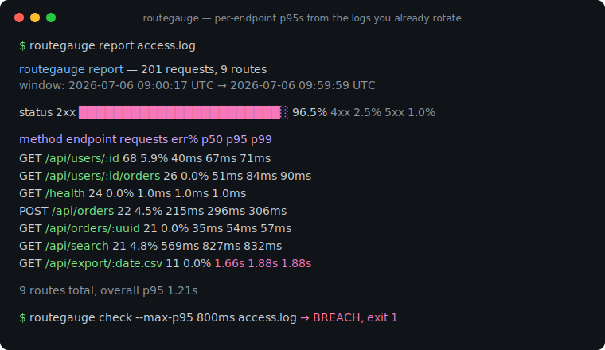
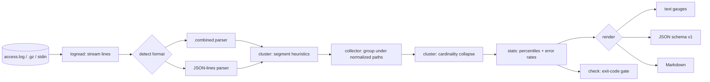

# routegauge

[English](README.md) | [中文](README.zh.md) | [日本語](README.ja.md)

[](LICENSE) [](go.mod) [](CHANGELOG.md)  [](CONTRIBUTING.md)

**routegauge：开源零依赖 CLI，把你本来就在轮转的访问日志变成 API 分析报告——自动端点聚类（`/users/123` → `/users/:id`）、按端点的延迟百分位、错误率报表。**



```bash
git clone https://github.com/JaydenCJ/routegauge && cd routegauge
go build -o routegauge ./cmd/routegauge    # single static binary, stdlib only
```

> 预发布：v0.1.0 尚未发布到任何包注册表；请按上述方式从源码构建（任意 Go ≥1.22）。

## 为什么选 routegauge？

有人问"周二上线之后 orders 端点的 p95 是多少？"，多数团队的诚实回答是*不知道*——API 没接入观测，而按事件计费的 APM（Moesif、Datadog）对一个 nginx 日志本来就能回答的问题来说太贵了。麻烦在于原始日志回答得很糟糕：`/users/123` 和 `/users/456` 是不同的 URL，于是 `awk` 直方图乃至 GoAccess 仪表盘都会把一个端点碎成几千行。routegauge 修的正是这一步。它流式读取你轮转下来的 `access.log*` 文件（含 gzip），自动把原始路径聚类成路由模式——数字 ID、UUID、哈希、日期按形状识别，slug 按基数识别，无需路由表——然后以终端报告、JSON 或 Markdown 输出每个端点的请求数、精确 p50/p95/p99 与错误率。它是一个报告 CLI，不是观测控制台：没有守护进程、没有存储、没有 agent、无需部署——`check` 子命令还能把同一组数字变成 exit 1 的发布门禁。

| | routegauge | GoAccess | awk / 一次性脚本 | Moesif / Datadog APM |
|---|---|---|---|---|
| 自动把 `/users/123` 聚成 `/users/:id` | ✅ | ❌ 原始 URL | ❌ 手工维护正则 | ✅ 需应用 SDK |
| 按端点的 p50/p95/p99 | ✅ 精确值 | ⚠️ 仅平均/最大耗时 | ❌ 自己造 | ✅ |
| 直接用你已有的日志 | ✅ | ✅ | ✅ | ❌ 要改造应用 |
| 直接读取轮转的 `.gz` | ✅ | ✅ | ⚠️ 得接 zcat | n/a |
| 带退出码的发布门禁 | ✅ `check` | ❌ | ❌ | ⚠️ 另配监控 |
| 成本模型 | 免费、本地 | 免费、本地 | 免费、易碎 | 按事件/主机计费 |
| 运行时依赖 | 0 | ncurses + C 库 | — | SaaS + agent |

<sub>核对于 2026-07-13：routegauge 只 import Go 标准库；GoAccess 构建依赖 ncurses（外加可选 GeoIP/SSL 库）；Moesif 与 Datadog 按事件/主机量计价。</sub>

## 特性

- **自动端点聚类** — 两个阶段：形状启发式把数字 ID、UUID、git 风格哈希、日期、邮箱和 API token 映射到 `:id`/`:uuid`/`:hash`/`:date`/`:email`/`:token`，再由基数分析把高扇出的 slug 段收拢成 `:param`。API 版本段（`v1`、`v2`）保持字面量。
- **精确延迟百分位** — 每个 method+route 的最近秩 p50/p90/p95/p99/avg/max，用全部样本计算而非近似 sketch。`--sort p95` 让慢端点立刻浮出。
- **错误率报表** — 每条路由的 4xx/5xx 计数与占比、状态码直方图、5xx 优先排序；nginx 的 `"-"` 坏请求行以 `(unparsed)` 保持可见而不是被吞掉。
- **就用你在轮转的文件** — 带 `$request_time` 的 combined/common 日志、靠别名表解析的 JSON-lines 日志、透明读取 `.gz` 轮转、单次运行多个文件、`-` 读 stdin、逐文件自动识别格式。
- **发布门禁，不是仪表盘** — `routegauge check --max-error-rate 5 --max-p95 800ms` 超限即 exit 1，可全局或按路由，直接接入部署钩子和夜间 cron。
- **三种输出格式** — 给人看的终端量表、给脚本用的稳定带版本 JSON（`schema_version: 1`）、可直接粘贴进 PR 评论和事故文档的 Markdown。
- **零依赖、完全离线** — 仅 Go 标准库；只读你指定的文件、只写 stdout，从不打开任何 socket。永无遥测。

## 快速上手

```bash
# fabricate a deterministic one-hour demo log (or point at your own access.log)
bash examples/make-demo-log.sh /tmp/demo-access.log
./routegauge report /tmp/demo-access.log
```

真实捕获的输出：

```text
routegauge report — 201 requests, 9 routes
window: 2026-07-06 09:00:17 UTC → 2026-07-06 09:59:59 UTC
skipped: 1 unparseable line

status  2xx ███████████████████████░ 96.5%   4xx 2.5%   5xx 1.0%

method  endpoint                     requests    err%      p50      p95      p99      max
GET     /api/users/:id                     68    5.9%     40ms     67ms     71ms     71ms
GET     /api/users/:id/orders              26    0.0%     51ms     84ms     90ms     90ms
GET     /health                            24    0.0%    1.0ms    1.0ms    1.0ms    1.0ms
POST    /api/orders                        22    4.5%    215ms    296ms    306ms    306ms
GET     /api/orders/:uuid                  21    0.0%     35ms     54ms     57ms     57ms
GET     /api/search                        21    4.8%    569ms    827ms    832ms    832ms
GET     /api/export/:date.csv              11    0.0%    1.66s    1.88s    1.88s    1.88s
GET     /assets/app.3f8a92b1c04d.js         7    0.0%    3.0ms    3.0ms    3.0ms    3.0ms
-       (unparsed)                          1  100.0%   0.00ms   0.00ms   0.00ms   0.00ms

9 routes total, overall p95 1.21s
```

看看聚类器做了什么（`routegauge endpoints`，真实输出）：

```text
GET     /api/users/:id
        68 requests, 65 distinct paths — e.g. /api/users/1071, /api/users/1261, /api/users/1373
GET     /api/users/:id/orders
        26 requests, 25 distinct paths — e.g. /api/users/1100/orders, /api/users/1172/orders, /api/users/1217/orders
```

给发布上门禁（`routegauge check`，超限退出码 1）：

```text
overall error rate                                   3.5%  (limit 5.0%)  ok
overall p95                                        1.209s  (limit 800ms)  BREACH
check: FAIL
```

轮转日志和结构化日志的用法完全一样：

```bash
routegauge report /var/log/nginx/access.log /var/log/nginx/access.log.*.gz
kubectl logs api-7d4b | routegauge report --log-format jsonl -
```

## 让日志带上延迟字段

百分位需要一个耗时字段；纯 combined 日志没有（routegauge 仍会报告流量与错误率，并明确提示）。nginx 加一行即可：

```nginx
log_format timed '$remote_addr - $remote_user [$time_local] "$request" '
                 '$status $body_bytes_sent "$http_referer" "$http_user_agent" '
                 '$request_time';
access_log /var/log/nginx/access.log timed;
```

对 JSON-lines 日志，routegauge 解析第一个命中的别名——字段名自带单位：

| 字段名 | 单位 |
|---|---|
| `request_time`、`duration`、`latency`、`response_time`、`elapsed`、`duration_s` | 秒 |
| `duration_ms`、`latency_ms`、`response_time_ms`、`request_time_ms`、`elapsed_ms`、`time_taken_ms` | 毫秒 |
| `duration_us`、`latency_us` / `duration_ns`、`latency_ns` | 微秒 / 纳秒 |
| 以上任意字段写成 Go duration 字符串（`"12.5ms"`） | 按字面值 |

## 端点聚类

阶段 1 按形状对每个段分类；阶段 2 把不同字面量兄弟数超过 `--cluster-threshold`（默认 12）的树位置收拢成 `:param` 并递归合并子树。完整规则、边界反例与调参建议见 [docs/clustering.md](docs/clustering.md)。

| 原始路径 | 路由 |
|---|---|
| `/api/users/1042` | `/api/users/:id` |
| `/api/orders/9e107d9d-372b-4b6e-8a2f-276173a5f1b3` | `/api/orders/:uuid` |
| `/commits/da39a3ee5e6b…` | `/commits/:hash` |
| `/api/export/2026-07-06.csv` | `/api/export/:date.csv` |
| `/products/blue-widget`（× 数百个 slug） | `/products/:param` |
| `/api/v2/users/7` | `/api/v2/users/:id` — 版本段保持字面量 |

## CLI 参考

`routegauge [report|endpoints|errors|check|version] [flags] <files…>` — 文件可为普通文件、`.gz`，或 `-` 表示 stdin；flag 写在文件前。退出码：0 正常、1 check 超限、2 用法错误、3 运行时错误。

| Flag | 默认值 | 作用 |
|---|---|---|
| `--log-format` | `auto` | 输入方言：`auto`、`combined`（含 common）、`jsonl` |
| `--format` | `text` | 输出：`text`、`json`（含全部路由）、`markdown`（仅 report） |
| `--sort` | `requests` | 行序：`requests`、`p95`、`errors`、`route` |
| `--top` | `20` | 文本/Markdown 输出的行数（0 = 全部） |
| `--since` / `--until` | — | 时间窗口，`YYYY-MM-DD` 或 RFC3339 |
| `--method` / `--path-prefix` | — | 按方法 / 整段路径前缀过滤 |
| `--cluster-threshold` | `12` | 收拢为 `:param` 前可容忍的不同字面量数 |
| `--no-cluster` | 关 | 报告原始路径，不做聚类 |
| `--max-error-rate` / `--max-5xx-rate`（check） | 未设 | 4xx+5xx / 5xx 占比超过该百分数即失败 |
| `--max-p95` / `--max-p99`（check） | 未设 | 延迟超过该时长即失败（`800ms`、`1.5s`） |
| `--per-route` / `--min-requests`（check） | 关 / `10` | 对流量足够的每条路由也执行限制 |

## 验证

本仓库不带 CI；上述所有断言均由本地运行验证：

```bash
go test ./...            # 90 deterministic tests, offline, < 5 s
bash scripts/smoke.sh    # end-to-end CLI check, prints SMOKE OK
```

## 架构



## 路线图

- [x] v0.1.0 — combined/common + JSON-lines 解析、两阶段端点聚类、精确百分位、错误报表、`check` 门禁、gzip/stdin 输入、90 个测试 + smoke 脚本
- [ ] `--buckets 1h` 时序模式，绘出一天内 p95 与错误率的走势
- [ ] 对比模式（`routegauge diff before.log after.log`）给出发布 A/B 结论
- [ ] 文本报告中按路由的延迟直方图
- [ ] Apache `%D`（微秒）与 LTSV 输入方言
- [ ] 可选的按来源 IP 细分，用于滥用排查

完整列表见 [open issues](https://github.com/JaydenCJ/routegauge/issues)。

## 贡献

欢迎 issue、讨论与 PR——本地工作流（格式化、vet、测试、`SMOKE OK`）见 [CONTRIBUTING.md](CONTRIBUTING.md)。入门任务见 [good first issue](https://github.com/JaydenCJ/routegauge/issues?q=is%3Aissue+is%3Aopen+label%3A%22good+first+issue%22) 标签，设计讨论在 [Discussions](https://github.com/JaydenCJ/routegauge/discussions)。

## 许可证

[MIT](LICENSE)
